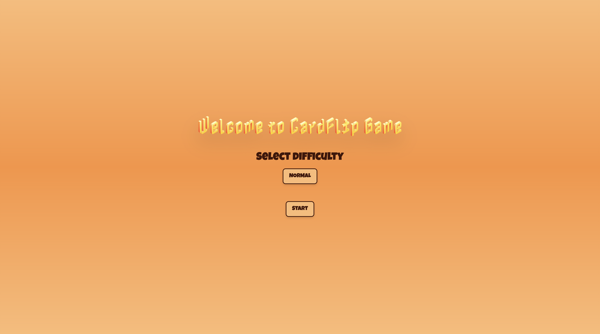
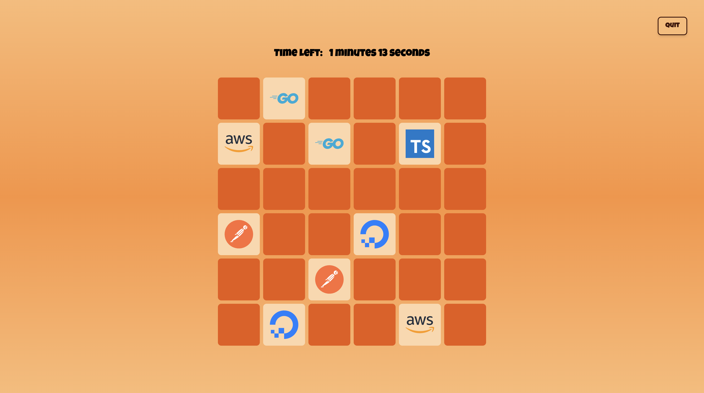

# Card Flip Game

Welcome to the Card Flip Game! This engaging single-player memory challenge invites you to test your skills as you flip cards to find matching pairs.




## Features

- **Interactive Gameplay**: Flip cards and match pairs.
- **Levels**: Progress through various difficulty levels.
- **Timer**: Race against the clock to complete each level.

## Demo

[https://card-flip-game-gules.vercel.app](https://card-flip-game-gules.vercel.app)

## Installation

Clone the repository:

```bash
git clone https://github.com/piyush-rawat/card-flip-game.git
```

Navigate to the project directory

```bash
cd card-flip-game
```

Install the dependencies

```bash
npm install
```

Run the project

```bash
npm run dev
```

## Usage

1. Click to flip a card.
2. Try to find and match pairs.
3. Complete the level before time runs out!

## Technologies and Frameworks Used

- Next.js
- Tailwindcss
- Framer Motion
